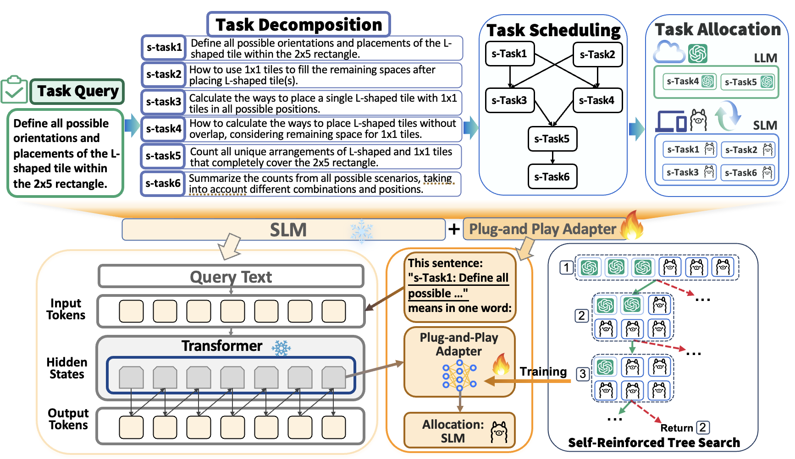

# Official Implementation for WWW'25 :fire: **''Division-of-Thoughts: Harnessing Hybrid Language Model Synergy for Efficient On-Device LLM Agents''**! :rocket:





## Abstract

> The rapid expansion of web content has made on-device AI assistants indispensable for helping users manage the increasing complexity of online tasks. The emergent reasoning ability in large language models offer a promising path for next-generation on-device AI agents. However, deploying full-scale Large Language Models (LLMs) on resource-limited local devices is challenging. In this paper, we propose Division-of-Thoughts (DoT), a collaborative reasoning framework leveraging the synergy between locally deployed Smaller-scale Language Models (SLMs) and cloud-based LLMs. DoT leverages a Task Decomposer to elicit the inherent planning abilities in language models to decompose user queries into smaller sub-tasks, which allows hybrid language models to fully exploit their respective strengths. Besides, DoT employs a Task Scheduler to analyze the pair-wise dependency of sub-tasks and create a dependency graph, facilitating parallel reasoning of sub-tasks and the identification of key steps. To allocate the appropriate model based on the difficulty of sub-tasks, DoT leverages a Plug-and-Play Adapter, which is an additional task head attached to the SLM that does not alter the SLM's parameters. To boost adapter's task allocation capability, we propose a self-reinforced training method that relies solely on task execution feedback. Extensive experiments on various benchmarks demonstrate that our DoT significantly reduces LLM costs while maintaining competitive reasoning accuracy. Specifically, DoT reduces the average reasoning time and API costs by 66.12% and 83.57%, while achieving comparable reasoning accuracy with the best baseline methods.
>


---

## Experiment:
### Openai Key Setup:
:gear:Run: Please put your openai key in function *setOpenAi()* and prepare your local model in *setlocal()* (DoT/utils.py):

```
def setOpenAi(keyid = 0):
    # set your openai key here.
    if keyid == 0:
        api_key = ""
    client = OpenAI(api_key=api_key)
    addtoken(-1)
    return client

def setLocal():
    client = OpenAI(
        api_key="EMPTY",
        base_url="your llm deploy url",
    )
    return client
```

You can set more than one api key for usage.

**NOTE:** The LLM client definition needs to meet the following calling format: `client.chat.completions.create(model, messages=messages)`, so that it can smoothly support the calling format of the `askLLM` function in `utils.py`. If the question-answer format of your LLM deployment does not comply with the OpenAI client call interface, please make sure to modify the `askLLM` function accordingly.


---

### For MATH / CHAMP / DROP / SCAN / P3 / CSQA benchmarks:
You can download the compressed package *Task_Datasets.zip* of the processed benchmark files from the link *https://pan.baidu.com/s/11qo6CsSomL9ILpmHJmgzpw?pwd=7gs7* with the password *7gs7*.

The reasoning process is divided into the following steps:
1. Execute task decomposition, breaking the task into multiple smaller sub-tasks that are easier to solve. This is typically handled by `{benchmark}_dotrun_step1.py`.
2. The adapter predicts the difficulty coefficient of each sub-task based on its text, and then determines the model allocation strategy. The results of the model assignment are already saved in the `TepRes` folder under each benchmark, such as `DoT/MATH_Trys/TmpRes/step2In_MATH_last.json`.
3. Based on the model allocation strategy, reasoning is performed in the order of the dependency graph to obtain the final answer. This is generally handled by `{benchmark}_dotrun_step2.py`.

#### Running:

```
cd MATH_Trys
python MATH_dotrun_step1.py
python MATH_dotrun_step2.py

cd CHAMP_Trys
python CHAMP_dotrun_step1.py
python CHAMP_dotrun_step2.py

cd DROP_Trys
python DROP_dotrun_step1.py
python DROP_dotrun_step2.py

cd Puzzle_Trys
python Puzzle_dotrun_step1.py
python Puzzle_dotrun_step2.py

cd CSQA_Trys
python CSQA_dotrun_step1.py
python CSQA_dotrun_step2.py

cd SCAN_Trys
python SCAN_dotrun_step1.py
python SCAN_dotrun_step2.py
```

#### About Adapter:

The preceding step2 code leverages the results of the adapter assignment. To replicate the model assignment experiment or train and test on your new dataset, please navigate to the VLLM folder, use `adapter_training.py` for training, and use `adapter_application_xxx.py` to load the trained parameters for prediction. The trained adapter parameters can be obtained from the following link: 
https://pan.baidu.com/s/15xge8XDfJRgK6ObTYVYB9g 
with the password `96e6`. 

Currently, the model assignment module has not yet been integrated with the overall reasoning module and needs to be carried out separately. Combining them into a one-click workflow is part of our near-term future work.

---

### For WebShop benchmark :shopping_cart:

The webshop benchmark has built a simulated e-commerce website environment with 1.18 million real-world products and 12,087 crowd-sourced text instructions. 
Before testing and usage, we need to configure the environment first.

#### Initial Setup

1. Clone the source environment repository from [webshop](https://github.com/princeton-nlp/WebShop):

```bash
git clone https://github.com/princeton-nlp/WebShop
```

2. Follow the setup instructions from the original WebShop [README.md](https://github.com/princeton-nlp/WebShop/blob/master/README.md) to configure the dataset and environment.

3. Put all python files in the `WebShop` directory.

#### Configuration Changes Required

Before running the experiments, make the following modifications:

1. Update the LLaMA client URL:
   - Locate the LLaMA client configuration.
   - Replace the default URL with your server URL.

2. Modify the WebShop URL:
   - The webshop URL is used to retrieve page information and product details from the environment.
   - Default: `localhost:3000/ABC`.
   - Change to your customized URL.

3. Update Openai API key:
   - Replace the key with your Openai API key in the setOpenAi function in `utils.py`.

#### Dataset Building

For test set generation, run the following command:

```bash
python webshop_testset_building.py
```

For training set generation, run the following command:

```bash
python webshop_trainset_building.py
```

Note: After building the dataset, use the formatting_building jupyter notebook to format the dataset.

#### Running:

```bash
# COT (Chain of Thought)
python webshop_cot.py 

# TOT (Tree of Thoughts)
python webshop_tot.py

# DataShunt
python webshop_datashunt.py

# DOT (Division of Thoughts)
python webshop_dot.py
```

